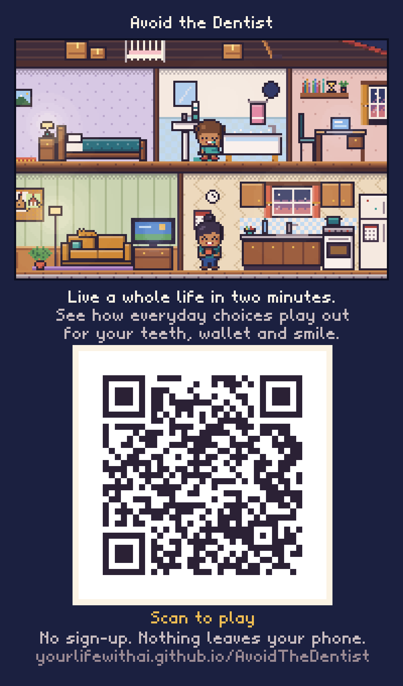

# Avoid the Dentist

*A cozy pixel-art life-sim about the everyday choices that add up to a lifetime of teeth, comfort, confidence and money.*


You live one life, from the first tooth to the rocking chair, in a dollhouse cutaway. Time runs by itself; you set habits,
pick a job, play sports, answer life's little prompts, and watch a *person* (not their teeth) live with the results.
Replay any moment with the same luck and one different choice, and see your life as one of 100 lives like it.

**Status: M0 plus a patient app you can hand out today.**

## For patients: scan and play

**[yourlifewithai.github.io/AvoidTheDentist](https://yourlifewithai.github.io/AvoidTheDentist/)**. Or print the QR code: [qr.png](docs/qr/qr.png), or the [waiting-room poster](docs/qr/poster.png).



- **No accounts and no personal information.** A strict content security policy blocks every network request, so nothing a patient taps leaves the phone. Nothing is stored.
- **How it works:** a patient builds a life from 13 everyday-habit questions, or picks one of 17 stories (also the clinical scenario list). They watch it play out in the house, then get a Life Story:
  - cost, teeth, pain and years hiding a smile;
  - the Acid Clock for their day, and their garden at 35 and 70;
  - "change one thing", averaged over 40 same-luck pairs;
  - 100 lives like theirs;
  - tool shed picks with evidence badges.
- **Works offline** after the first visit (a service worker caches it) and can be added to the home screen.
- **Product links** go in `web/app/links.js`, empty for now. Links never change which tools are picked. A disclosure shows only when an affiliate link is active, and dentist-only tools point to the dental team.
- **Publishing:** `.github/workflows/pages.yml` rebuilds and publishes to GitHub Pages on every push to `main`. `npm run app` builds it locally into `site/`.

- **[Game plan](docs/GAME_PLAN.md):** vision, loops, choice systems, the hidden model, money, art direction, ethics, tech, roadmap, open questions
- **[Simulation report](docs/SIM_REPORT.md):** calibration vs. CDC data, preset lives, which choices matter most, Maya's "same luck" pair
- **[Research notes](docs/research/):** the evidence base, with verification tags
- **Art samples:** `docs/art/` (house, UI mockup, life lineup, cast, feelings, work & play, two lives, clinic, props, palette)

## Run it

Requires Node 18+. The art and the model have no dependencies.

```bash
npm run art           # render every art sample to docs/art/
npm run sim           # preset lives, 500 each
node sim/levers.mjs   # one choice at a time, same luck
node sim/calibrate.mjs  # model vs. US surveillance data
node sim/report.mjs   # regenerate docs/SIM_REPORT.md
npm run app          # build the patient app into site/ (with qr.png and poster.png)
npm install && npm run review   # build docs/review.html: live art, the chart and a What-If Lab in one page (needs esbuild)
```

## Layout

- `art/`: pixel-art toolkit (framebuffer, role-based palette sprites, bitmap font) and every sprite and scene. It runs in Node and the browser.
- `sim/`: the deterministic life model, with evidence-tagged parameters and "same luck" random streams.
- `web/app/`: the patient app (phone-first, private, offline).
- `web/`: the single-file review page (live house demo, gallery, What-If Lab running the real model in a Web Worker).
- `tools/`: art export, preview and the review-page build.

Not medical advice. Costs are typical 2024–26 US figures.
