# Avoid the Dentist: Game Plan v0.2

*A cozy pixel-art life-sim about the everyday choices that add up to a lifetime of teeth, comfort, confidence and money.*

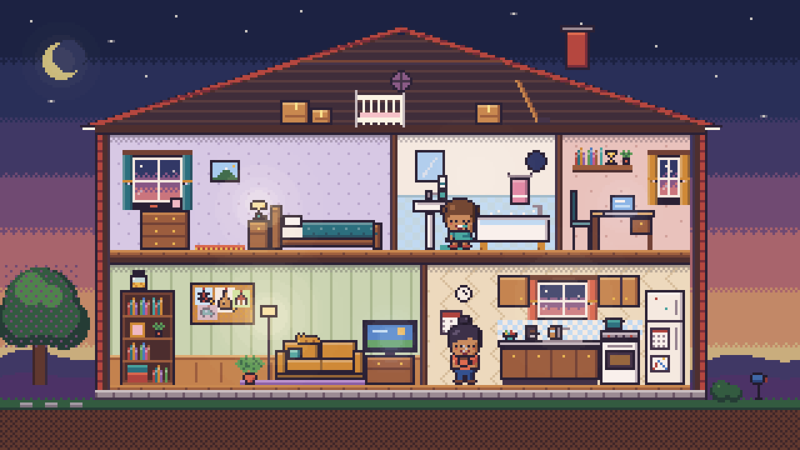

> **Status:** planning checkpoint (M0). This folder contains the plan, twelve art samples built with a reusable pixel-art toolkit, and a working prototype of the hidden simulation, calibrated against CDC data. **New in v0.2:** the Acid Clock (§4.5, §6.2), a 24-hour plaque-pH model that now drives decay in the simulation, and your answers to the open questions (§14). Every simulation number in this document comes from `node sim/report.mjs` (see [SIM_REPORT.md](SIM_REPORT.md)); fees and evidence come from the [research notes](research/).

---

## 0. At a glance

**The pitch.** You live one life, from the first tooth to the rocking chair, in a dollhouse cutaway. Time runs by itself like an idle game. You set habits, pick a job, play sports, answer life's little prompts, and watch what happens. You never stare at a tooth. You watch a *person*: smiling freely or hiding a smile, sleeping or lying awake, a dream board filling with trips and guitars or a counter stacking up with bills.

**The name is the joke.** The surest way to *avoid the dentist* (the big, scary, expensive dentist) is to see the small, boring one regularly. The game never says this. The player discovers it.

**Five ideas carry the whole design:**

1. **The person, not the teeth.** Every dental outcome shows up as behavior, posture, props, rooms and money.
2. **The bill comes later.** A single choice at 34 barely registers by 45 and dominates by 70. Time compression makes the delay playable.
3. **Same luck, one change.** "Twin Lives" replays your life with an identical seed and one different choice. This is the most honest cause-and-effect demo a game can offer, and the model is built for it.
4. **100 lives like yours.** At the end, your life is shown as one pixel person among 100 simulated lives with your choices. Luck is real, but so are the odds.
5. **Never scold.** The dentist is kind, going back after years is celebrated, and money, time and access barriers are visible without blame.

**The Acid Clock ties the habits together.** Every day in the game has a Stephan curve. Each snack or sugary drink drops plaque pH, and saliva brings it back. The simulation turns the time spent below pH 5.5 into decay; that's demineralization, and the rest of the day is repair. Foods differ: candy dips deep, crackers linger. Timing matters: the same sweets as dessert cost a fraction of the acid time they cost as snacks, and a snack after brushing lasts all night. The mouth matters too: a drying medication stretches every dip 2–3×. See §4.5.

**What the prototype model says** (same-luck paired runs, typical US life as baseline):

| One change | Lifetime cost | Teeth lost by 80 | Pain days | Years hiding smile |
|---|---:|---:|---:|---:|
| Sips 3 sodas a day instead of 1 | +$16,178 | +1.9 | +22 | +3.2 |
| Only goes to the dentist when it hurts | +$15,675 | **+9.2** | **+150** | **+13.0** |
| Brushes once a day instead of twice | +$12,479 | +1.2 | +7 | +2.5 |
| Smokes from 18 | +$12,122 | +1.8 | +45 | +3.3 |
| Hockey 8–30 without a mouthguard | +$3,299 | +0.8 | +8 | +13.9 |
| ...with a custom mouthguard instead | +$2,452 | +0.5 | +4 | +6.0 |
| A snack after brushing at night | +$2,782 | +0.2 | +3 | +0.2 |
| C-section + parents with untreated decay | +$826 | +0.1 | +1 | +0.2 |
| Checkups every 6 months instead of yearly | +$1,313 | −0.1 | −4 | −0.3 |
| Sweets as dessert with meals instead of snacks | −$2,343 | −0.2 | −3 | −0.3 |
| Picks the cheapest fix every time | **−$4,866** | **+2.4** | 0 | +2.9 |

And the headline for Maya, our pastry chef: when the dentist's office calls at 34, "Later..." costs **nothing extra by age 45** (median $0) and **$11,319 plus 4 teeth by age 80**. It ends worse in 94% of 400 same-luck pairs.

**Your answers** (September 2026) are in [section 14](#14-decisions-and-open-questions): adults, young adults and parents at home; a free public game that clinics can use; fluoride framed as part of the demineralization and remineralization balance, not as a water-supply debate; and a dentist on the team.

---

## 1. Goals

### 1.1 Who it's for

| Audience | Where they meet it | What they need |
|---|---|---|
| **Adults and parents** (primary) | At home, on a phone; a clinic website; a waiting-room tablet | A 15–20 minute life that changes how they think about "later" |
| **Dental teams** (secondary) | Chairside, on a tablet | A 60-second *What-If Lab*: "here's you with soda vs. water" |
| **Teens** (tertiary) | School health class | Sports guards, energy drinks, vaping, first job |

This is **not** a kids' brushing-timer game. That market is crowded: Toothsavers, Brush DJ, Disney Magic Timer, Colgate Magik and Pokémon Smile. The design research found no game or app that models an adult lifetime, costs, opportunity cost, or dental anxiety. That gap is ours.

### 1.2 What players should walk away believing

1. **Small now, or big later.** Early care is cheap and fast. The same problem left alone becomes expensive, painful and permanent.
2. **How often, not just how much.** Every sugar hit starts an ~30-minute acid clock. Sipping a soda all afternoon is many hits.
3. **Gum disease is quiet.** Gingivitis is reversible within weeks. Periodontitis is not. Smokers bleed *less*, so the warning sign disappears.
4. **Fear feeds itself, and there are exits.** Fear leads to avoidance, then to bigger treatment, then to more fear. The exits: tell the dentist, agree a stop signal, start with a cleaning, try CBT, ask about sedation.
5. **It's never too late.** Coming back at 40 still saves most of your teeth.
6. **Protect teeth from hits and from yourself.** Mouthguards for sport, night guards for grinding.
7. **Your start matters a little; your habits matter a lot.** Birth mode and parents' mouths give a small head start or handicap, which daily habits outweigh.
8. **Money is a health factor.** Insurance has an annual maximum (often ~$1,500). Traditional Medicare doesn't cover routine dental. The cheapest fix today can be the most expensive smile.

### 1.3 Success criteria for the pilot (M5)

- ≥70% of players who start a life finish it, and ≥40% replay with a change.
- Knowledge gain on a 10-item pre/post quiz, and a higher stated intention to book a checkup.
- Low defensiveness: no increase in skip or mock behavior on consequence screens (see §10).

---

## 2. Design pillars

| Pillar | In practice | We will not |
|---|---|---|
| **The person, not the teeth** | Expressions, poses, props, rooms, social life and the ledger carry every outcome | Show tooth close-ups, decay, blood or gore |
| **Cause, delay, effect** | Time compression: a year is ~12 seconds. Delayed consequences land within minutes of play | Explain consequences before they happen |
| **No shame, all agency** | Kind dentist; returning after years is a celebrated milestone; barriers are visible and not blamed | Scold, moralize, or punish with "game over" |
| **Cozy idle** | Life runs itself; you steer habits, answer cards and buy helpers; routines feel like comfort | Build a clicker grind or timers that nag |
| **Honest numbers** | Evidence-tagged parameters, calibration against CDC data, an optional "why" view, luck shown as luck | Overstate weak evidence (C-section, xylitol, flossing) |

---

## 3. References we borrow from

| Game | What we take |
|---|---|
| **Little Computer People** (Activision, 1985) | The direct ancestor: a side-view "house on a disk" where you watch one person's routine. A flat side view is far cheaper to draw than isometric. |
| **The Sims** (Maxis, 2000) | Cutaway dollhouse, needs shown as icons in thought bubbles, careers and household money |
| **Tiny Tower** (NimbleBit, 2011), **Kairosoft** sims | Readable micro-pixel people in stacked rooms; gentle idle growth; generations |
| **Unpacking** (Witch Beam, 2021) | A life told through objects: toothbrushes, mouthguards, appointment cards and soda cans that change over decades |
| **BitLife** (Candywriter, 2018) | The year-by-year "age up" loop with event cards and dry humor |
| **Reigns** (Nerial, 2016) | Fast binary cards whose effects build up out of sight |
| **The Oregon Trail** (MECC) | Edutainment on hidden probabilities, checked against real sources, with plainly announced outcomes |
| **Spent** (McKinney, 2011) | Money and time trade-offs that show structural barriers without blame |
| **Papers, Please** (Lucas Pope, 2013) | The end-of-year ledger: income, dental spending, days in pain, days off work |
| **Passage** (Jason Rohrer, 2007), **Florence**, **Before Your Eyes** | A whole life compressed; age shown through the sprite; short milestone vignettes |
| **Cookie Clicker**, **Universal Paperclips**, **A Dark Room** | Automation as progress: habits "run themselves" once formed; systems unlock as they become relevant |
| **Stardew Valley** (ConcernedApe, 2016) | Tone: routine as comfort, warm pixel art |
| **Plague Inc.** (Ndemic, 2012) | A legible stat model you can inspect after the fact |

---

## 4. How it plays

### 4.1 Modes

| Mode | Length | What happens |
|---|---|---|
| **Live a Life** (story) | 15–20 min | Birth to 80 in the house. Parents decide early on; you take over as a teen. Event cards, habits, helpers, a yearly ledger. Ends with your *Life Story*. |
| **What-If Lab** (sandbox) | 1–3 min | Set every choice on one screen (birth, parents, diet, job, sport, visits, insurance), press *Live it*, and jump to the Life Story. Built for chairside use and curious players. |
| **Twin Lives** | 2–5 min | Pick any moment in a finished life, change one choice, and watch both houses side by side with the **same luck**. The game asks "What changed?" before it shows the ledger. |
| **100 Lives Like Yours** | 30 s | Your choices run 100 times as an icon array of 100 tiny pixel people: how many kept all their teeth, needed a root canal, or lost a tooth to gum disease. You are one of them. |
| *Next Generation* (post-launch) | — | Your child inherits your household's habits, microbiome and (a little) your dental fear. The loop closes. |

### 4.2 Loops

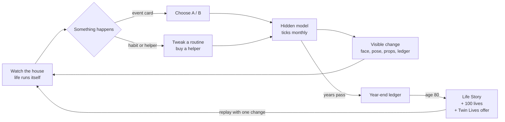

- **Moment to moment (seconds):** the character moves between rooms doing routines: brushing, cooking, working, sleeping. You tap them for a thought bubble, toggle habits, or answer a card. The game auto-pauses on cards.
- **Session (minutes):** one life stage (childhood, teens, 20s–30s, midlife, later life) ends with a year-end ledger and a "you at this age" portrait.
- **Meta (a replay):** finish a life, read the Life Story, and replay with one change.

**Pacing:** at 1× speed, a year takes ~12 s (2×/4× available). A life has ~50 cards, and a first life takes ~18 minutes.

### 4.3 Life stages

| Stage | Who decides | Key choices | Key moments (cards) | House |
|---|---|---|---|---|
| **Baby (0–2)** | Parents | First dental visit (when the first tooth appears / at 3 / only if there's a problem), bedtime bottle, brushing with a smear of fluoride paste, shared spoons | First tooth; "Should we go to the dentist already?"; the pacifier drop | Nursery in the study; the crib (later in the attic) |
| **Kid (3–12)** | Parents, then shared | Visit rhythm, pediatric vs. general dentist, sealants, snacks and juice, sports | First cleaning; "a scary visit" or "a sticker and a balloon"; a playground fall | Kid's room, backyard |
| **Teen (13–18)** | You (with parents) | Sodas and energy drinks, brushing, braces, mouthguard, vaping | Braces; hockey tryouts; wisdom teeth | Posters, a hoodie on the chair |
| **Young adult (19–29)** | You | First job, insurance, moving (finding a new dentist), diet | "Your plan now includes dental. Enroll?"; the first cavity you pay for yourself | Apartment variant of the house |
| **Adult (30–49)** | You | Visits, work stress and grinding, kids, night guard, sweet coffee | "The dentist's office called..."; a cracked tooth at a birthday dinner; pregnancy gums | Family house; dream board |
| **Midlife (50–64)** | You | Gum treatment, keeping up maintenance, money | "Deep cleaning or wait?"; "Root canal and crown ($2,650) or pull it ($250)?" | Reading glasses on the table |
| **Later life (65–80)** | You | Medicare vs. a dental plan, dry-mouth medications, dentures or implants | "Medicare doesn't cover this?!"; grandkids' visit; the family photo | Cane by the door; the photo wall |

### 4.4 The idle layer: habits are your automation

Idle games make progress through automation. Here, **habits are the automation**, and the upgrades are real-world nudges that make good behavior automatic.

- **Habit strength.** A habit you keep fills a bar over about two in-game months (after Lally 2010: a median of 66 days to automaticity). After that it "runs itself", and missing a day costs almost nothing.
- **Helpers** (bought with money or unlocked by events), each with an honest evidence tag:

| Helper | Effect in the model | Evidence |
|---|---|---|
| Electric toothbrush with a timer | Less plaque; brushing adherence up | Moderate (11–21% less plaque) |
| Floss picks by the couch | Interdental cleaning becomes daily | Low certainty, small gum benefit |
| Reusable water bottle | Swaps some sipped sodas for water | Mechanism: fewer acid clocks |
| "Book the next visit before you leave" | Fewer skipped checkups | Design assumption |
| Night guard | Protects teeth from grinding (not the habit itself) | Protection plausible; effect on grinding itself not shown |
| Custom sports mouthguard | ~55% fewer dental injuries | Moderate (Knapik 2007, unverified) |
| Prescription high-fluoride toothpaste | For high-risk mouths | Moderate |
| Risk test / microbiome test | **Reveals** your hidden risk and personalizes advice; the benefit comes from what you do next | Tests alone don't change outcomes |
| Anxiety toolkit: stop signal, headphones, CBT | Fewer bad experiences; CBT cuts fear | CBT: moderate (~77% attending years later, unverified) |
| Dental insurance / savings plan | Changes who pays and how often you go | Strong for access |

- **Money compounds.** Savings grow at a 5% real return, which is where "what else it could have been" comes from. Dental bills interrupt the compounding. That is the idle-game "number go up" with a lesson inside it.
- **The dream board** in the living room holds pinned goals: a trip, a guitar, a bike, a car, a home. Reached goals get a gold star; money diverted to emergency dental work makes the photos fade. Players see opportunity cost on the wall of their own house.

### 4.5 The Acid Clock: a day, as the teeth feel it

The idle layer runs days, so the game can show what a day does. **The Acid Clock** is a slim strip along the bottom of the house screen. It shows the last 24 hours of plaque pH like a heart-rate trace:
- tiny food and drink icons sit at the times she ate;
- a blue band marks sleep;
- whatever dips below the red line is filled in.

It never shows a tooth; it shows her day. Tap it for the day recap (art sample in §8).

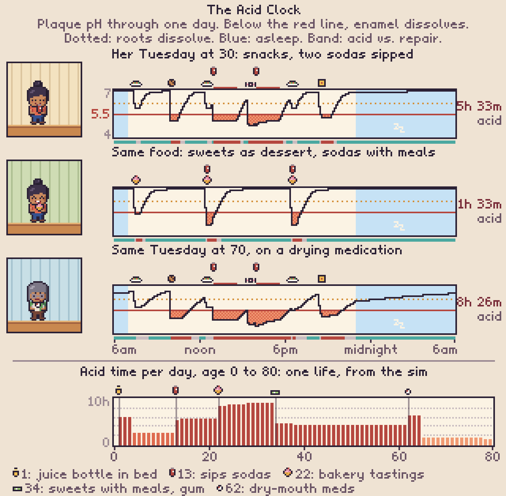
*Three versions of Maya's Tuesday, and acid time per day across one simulated life. Numbers are from `sim/stephan.js` and `sim/model.js`.*

**What it teaches, with no lecture:**

| Lesson | What the player sees (typical mouth) |
|---|---|
| **What** you eat | Candy and soda dip deepest. Chips, crackers and dried fruit linger. Cheese, nuts and veggies barely move it. Diet soda doesn't feed bacteria but bathes teeth in acid (erosion is tracked separately). |
| **When** you eat | Three sweet snacks between meals: **2h 06m** of acid. The same sweets as dessert: **57m**. Two sodas sipped all afternoon: **5h 33m**. The same sodas finished at meals: **3h 18m**. |
| **Sleep** | Saliva nearly stops in sleep. A cookie after brushing adds **2h 08m**, 1h 50m of it asleep. A toddler's juice bottle in bed: **3h 06m** of acid while asleep. |
| **The mouth** | Dry mouth (medications, age) stretches every dip: three snacks go from 2h 06m to **4h 31m**. Sucking candies for dry-mouth relief: **8h a day**. More cavity bacteria and thicker plaque dip deeper. |
| **Helpers** | Sugar-free gum after eating: 2h 06m → **1h 11m**. A water rinse helps a little. |
| **Your work** | A baker's tastings from 5 am: **4h 40m**. Night-shift snacks, with lower saliva at night: **4h 22m**. |

**Demineralization and remineralization.** The clock frames decay as a daily tug-of-war rather than a verdict. Time below the line is enamel dissolving. Time back above it, with saliva, fluoride, calcium and phosphate around, is repair. The next step (proposed in §14) is to draw the repair side too, so the strip reads as "acid vs. repair" and fluoride, saliva and sealants have a visible job.

**Playing with it.** The day is set by the life stage, the job and the player's habit cards: snacks, drinks, "sweets with meals", "gum after eating", "water after snacks", "snack after brushing". Moving a candy from 3 pm to dessert is one tap, and the strip changes immediately. Foods that keep plaque above pH 5.7 for 30 minutes get a small tooth-friendly badge, after the Swiss tooth-friendly test. No numbers during play: the shape carries the message. Minutes show up in the recap and the *Why?* view.

**Tracked over a lifetime.** The Life Story gets an "acid time per day" band across ages 0–80, annotated with the choices that moved it. Maya's shows a juice bottle at 1, sodas at 13, bakery tastings at 22, dessert-not-snacks plus gum at 34, and a drying medication at 62.

### 4.6 Event cards

Each card has context art, two or three choices, hidden effects, and a *Why?* link that appears **after** the consequence lands. Examples by stage:

| Age | Card | Choices | Hidden effect |
|---|---|---|---|
| 0.6 | "A first tooth! Your pediatrician mentions a dental visit." | Book one now / Wait until 3 / Only if there's a problem | Anticipatory guidance may fix a risky habit; varnish starts; the familiarity lowers fear |
| 1.5 | "Bedtime is easier with a bottle of juice..." | Juice / Milk / Water | An all-night Acid Clock (~3 h below pH 5.5 while asleep) plus pooling on the upper front teeth, until 4 |
| 6 | "The dentist suggests sealants on the new molars ($42 each)." | Yes / Skip | Occlusal decay risk ×0.25 while retained |
| 9 | "Ow! A tooth hurts. It's been a while since a checkup." | Dentist today / Wait and see | Pediatric vs. general dentist and invasiveness drive a scary or fine visit |
| 14 | "Hockey tryouts! The team requires... nothing, actually." | Custom guard ($300) / Boil-and-bite ($25) / None | Injury risk ×0.45 / ×0.55 / ×1 |
| 16 | "A tooth got knocked out at practice!" | Put it in milk and go now / Wrap it in a tissue | Replant success ~60% only with the first choice (IADT) |
| 22 | "Your new job offers dental. $18 per paycheck." | Enroll / Skip | 100/80/50 coverage, $1,500 annual maximum |
| 27 | "Energy drinks are getting you through night shifts." | Keep going / Switch to water | Each can is a ~45-min acid dip, longer at night when saliva is low; erosion; grinding |
| 34 | "Voicemail from Dr. Reyes' office: it's been 18 months!" | Book it / Later... | Visit rhythm switches to "pain only" |
| 38 | "You wake up with a sore jaw again." | Ask about a night guard / Ignore | Crack and jaw-pain risk |
| 41 | "Root canal and crown ($2,650), or pull it ($250)?" | Save it / Pull it | Keep the tooth vs. a gap, drift, and implant later |
| 45 | "Your gums bleed when you brush." | Mention it at a checkup / Brush harder, softer, never mind | Gingivitis is reversible now; periodontitis later isn't |
| 48 | "Diagnosed with type 2 diabetes." | — | Perio ×1.86; gum treatment lowers HbA1c ~0.4 |
| 52 | "It's been 11 years. What will they think of me?" | Call a no-judgment practice / Not yet | Shame lowers visits; the kind dentist resets it |
| 62 | "Your new blood-pressure pill can cause dry mouth." | Ask about alternatives / Sip water, chew sugar-free gum / Suck on candies for relief | Dry mouth stretches every dip 2–3×; candies for relief mean ~8 h of acid a day |
| 66 | "Medicare doesn't cover cleanings?" | Buy a dental plan / Medicare Advantage / Go without | Coverage in later life |

### 4.7 The Life Story (end screen)

- **A timeline of moments:** a filmstrip of pixel vignettes (first visit, braces, the phone call at 34, the family photo at 70).
- **The ledger:** lifetime dental spending (you vs. insurance vs. your parents), days in pain, sleepless nights, days off work, and years you hid your smile.
- **What else it could have been:** the difference against a prevention-minded twin, shown as dream-board items ("a trip to Kyoto and a used car") and as its value invested at 5% real by 65.
- **100 Lives Like Yours:** an icon array; you are highlighted.
- **Twin Lives:** "Want to see what one different choice would have done?" The replay starts at the chosen moment with the same luck.

---

## 5. Choice systems

| System | Choices | Model effect (summary) |
|---|---|---|
| **Born into** | Vaginal birth / C-section; parents' oral health (healthy / average / untreated decay); anxious parents; fluoride where you grew up (a small, neutral circumstance, see §14); family insurance | Earlier and larger colonization by cavity-causing bacteria (C-section ~12 months earlier, Li 2005); starting fear level; access |
| **Parents' choices** | First visit timing; pediatric vs. general dentist; bedtime bottle; brushing; snacks; sealants; braces; shared spoons | Baby-tooth decay (which predicts adult decay, RR ~2.6); sealants; early experiences that set dental fear |
| **Your habits** | Sweet snacks per day; sweets with meals or between them; sodas (and *sipping*); diet soda and energy drinks; a snack after brushing; sugar-free gum or a water rinse after eating; brushing 0/1/2; fluoride toothpaste; interdental cleaning; electric brush; ice chewing | The Acid Clock (a plaque-pH curve for every day), which drives decay; the microbiome drifting with diet; erosion; plaque; gums |
| **Work** | Office, baker, warehouse, night nurse, rideshare, teacher, dental hygienist (easter egg) | Extra sugar, grinding from exertion or stress, shift work, savings rate, whether insurance comes with the job |
| **Play** | Hockey, basketball, football, soccer, boxing, skating, running; guard: none / boil-and-bite / custom | Dental trauma (chips, fractures, knocked-out teeth); endurance sport means sports drinks |
| **Body** | Smoking, vaping, pregnancy, diabetes (event), dry-mouth medication (later life), sleep apnea | Gum disease ×1.85 (smoking), ×1.86 (diabetes); dry mouth: every Acid Clock dip lasts 2–3× longer, plus lost repair, ×~2.4 decay; receding gums expose roots that dissolve at pH ~6.2 |
| **Mind** | Coping: tell the dentist, sedation, CBT | Anxiety level, which drives skipped visits and the fear, avoidance and bigger-treatment loop |
| **Knowledge** | Risk assessment or microbiome test | Reveals hidden traits; personalizes prevention |
| **Money** | Insurance type; treatment style (follow the plan / cheapest fix / only if it hurts); payment plans | Who pays; what gets treated; how teeth get replaced |

Any choice can change at any age. Under the hood that's a `phases` list, for example `{ age: 34, set: { visits: 'pain' } }`.

---

## 6. The hidden model

The prototype lives in `sim/`: ~800 lines of plain, deterministic JavaScript (`model.js`) with no dependencies. One life (0–80, monthly ticks) runs in ~11 ms, so the What-If Lab is instant and 100 Lives takes about a second (in a Web Worker).

### 6.1 Architecture

- **Monthly ticks** from birth to 80.
- **48 teeth.** 20 baby teeth erupt and shed; 28 permanent teeth erupt on real schedules (first molars at 6 and second molars at 12 are the sealant windows). Each tooth carries its own decay stage, restoration and history.
- **Mouth-level systems:** plaque, calculus, gum inflammation, clinical attachment loss (CAL); the microbiome's cavity-causing load; grinding; dental anxiety; insurance and money.
- **Hidden traits at birth:** enamel resilience; gum susceptibility class, from Löe 1986 (8% rapid, 81% moderate, 11% resistant); baseline grinding; temperament; age at colonization.
- **"Same luck" by construction.** Every stochastic process (each tooth's decay, each restoration's failure, each crack, each injury, each skipped visit) draws from its **own named random stream**. Events fire when accumulated hazard crosses an exponential threshold from that stream. Two lives with the same seed therefore share luck process by process, so Twin Lives isolates the effect of the choice.

### 6.2 The Acid Clock (plaque pH)

`sim/stephan.js` builds a typical day for each stage of life and runs a minute-by-minute plaque-pH curve over it.

- **The day.** The plan, life stage and job set the schedule:
  - kids' bedtimes;
  - a baker up at 4:30 with tastings through the morning;
  - a night nurse who sleeps by day;
  - snacks spread through waking hours, or folded into meals as dessert;
  - drinks with how long they're sipped.
- **Each intake** drops pH by a food-specific depth, scaled by the mouth: more cavity bacteria and thicker plaque dip deeper and rest lower. It reaches bottom in minutes and holds while the food lingers. Sticky and starchy foods linger longer, and longer still with low saliva. Then it recovers exponentially with saliva flow: 1 awake, 0.7 at night, 0.08 asleep, ×0.35 with dry mouth. Overlapping intakes add their acid.
- **Helpers:** chewing a meal, sugar-free gum, cheese and a water rinse speed clearance and wash away lingering food.
- **Outputs per day:**
  - acid time and dose below pH 5.5 (enamel);
  - acid time and dose below 6.2 (exposed roots);
  - erosion from acidic drinks.
- **Into the life model:**
  - Decay pressure = (the day's acid dose ÷ a reference day of three snacks between meals)^0.75, floored at ×0.35. Good fluoride use halves the excess.
  - Once attachment loss exposes roots, root decay follows the dose below 6.2.
  - Acid baths from drinks add up to +15%.
  - Dry mouth adds a residual ×1.15 for lost repair.
  - The day is recomputed, and cached, whenever habits, job, stage, bacteria, plaque or saliva change.
- **Calibration anchors:**
  - one more separate sweet snack a day ≈ +25–30% (as with the old sugar-exposure rule);
  - a high mutans load ×1.8;
  - brushing once a day ×1.34 in total;
  - dry mouth ×2.4 in total.
  - Base decay rates were re-tuned so the population still matches CDC data (§6.8).
- **What it is and isn't.** The shape follows Stephan 1944: a nadir within minutes and 30–60 minutes back for a sugary snack in a normal mouth. Critical pH values are from the literature. The per-food depths and linger times are design estimates. It's a teaching model of plaque pH, not a clinical predictor, and it's the first thing I'd like you to review as a clinician.

### 6.3 The decay ladder and the restorative cycle

```mermaid
flowchart LR
  S[Sound] -->|sugar hits, bacteria, no fluoride| E[Enamel lesion]
  E -->|fluoride, low sugar: arrests| S
  E --> D[Dentin<br/>small filling ~$210]
  D --> Dp[Deep<br/>large filling ~$300]
  Dp --> Pu[Pulp<br/>root canal + crown ~$2,775]
  Pu --> Ab[Abscess<br/>extraction ~$200-345]
  Ab --> R[Replace<br/>implant + graft ~$5,000<br/>bridge / partial / gap]
  D -. fillings fail 2%/yr .-> Dp
  Dp -. 3.5%/yr .-> Pu
```

- **Progression** uses Mejàre's cohorts: enamel to dentin ~6%/yr in adults, and 65–86% of enamel lesions never reach dentin in 11 years. Adolescents progress ~2.5× faster and baby teeth ~3× faster. Deep lesion to pulp is a placeholder, flagged for clinical review.
- **Symptoms are honest.** Enamel and early dentin lesions are silent. Deep lesions cause occasional sensitivity. Pulp involvement means toothaches (~4 episodes a year). Only ~18% of decayed baby teeth ever hurt.
- **Detection:** a routine exam with bitewings finds early lesions 45% of the time, dentin lesions 75%, and deep ones 95%. An emergency visit mostly finds the tooth that hurts.
- **The restorative cycle:** fillings fail (secondary decay, fracture), and each redo is bigger. Large fillings crack. Crowns need redoing. Root canals can fail. This is the "death spiral of a tooth" (Elderton; Qvist), and the model reproduces it without being told to.

### 6.4 Gums

- **Gingivitis** follows plaque and calculus within weeks and clears within about a week of good hygiene (Löe 1965). It's reversible.
- **Attachment loss** accumulates only above an inflammation threshold, scaled by susceptibility class, smoking (×1.85), diabetes (×1.86), stress and age. With no care at all, the rapid class loses every tooth by about 45, matching Löe 1986. With cleanings and maintenance, it slows (~0.08 teeth/yr, Hirschfeld & Wasserman 1978).
- **Diabetes works both ways:** gum treatment lowers HbA1c ~0.43 points (Cochrane 2022). It's the one systemic link we present as more than an association.
- **Smokers bleed less:** the visible warning signal is quieter than the disease.

### 6.5 Grinding, cracks and trauma

- **Grinding** comes from a baseline trait plus job exertion or stress, energy drinks, smoking and age. A night guard protects the teeth ~80% when worn (~70% adherence). It doesn't stop the habit.
- **Cracks** mostly hit back teeth, much more often in teeth with big fillings or root canals and no crown, in grinders, and in ice chewers. Outcomes: a crown (55%), a root canal plus crown (30%), or loss of the tooth (15%).
- **Trauma:** toddler falls, kid and teen accidents, and sports. Hockey without a guard is ~10% a year while playing. Guards cut the risk to ×0.45–0.55. A knocked-out tooth has ~60% odds of being saved with the right first aid.

### 6.6 Fear and avoidance

- **Starting fear** comes from temperament plus anxious parents.
- **Each visit can go badly.** Odds rise with invasiveness (cleaning 3%, root canal 20%, emergency 30%), in childhood (×1.5), with existing fear (×(1+fear)), and with a general rather than a pediatric dentist for kids. Odds fall with coping tools.
- **Bad visits raise fear** (more in childhood); good ones slowly lower it.
- **Fear drives skipping:** skip odds are 6% + 80% × fear². Uninsured adds 12%, shift work 6%, and "it's been more than 3 years, they'll judge me" 10%. Above 0.7, you're an avoider who goes only when the pain is bad.
- **The vicious cycle emerges on its own:** fear, skipping, bigger problems, emergency visits, scary procedures, more fear. So do the exits (CBT, a gentle practice, telling the dentist).

### 6.7 Money

- **Fees** are typical US 2024–26 uninsured prices (see §7). Insured patients pay in-network rates (−25%).
- **Insurance:** employer PPO (100/80/50, $50 deductible, $1,500 annual maximum); Medicaid for kids (full); Medicaid for adults (emergency-only states); traditional Medicare (no routine dental); Medicare Advantage (~$1,300 cap, 50%).
- **Savings** depend on the job ($2,500–$7,000 a year) and grow at 5% real. Dental costs come out of savings (parents pay until 18). A running "no-dental twin" wallet gives the opportunity cost.

### 6.8 Calibration (3,000 random US-like lives vs. CDC surveillance)

| Metric | Model | Target | Source |
|---|---:|---:|---|
| Caries experience, baby teeth, ages 2–5 | 23.7% | 23% | CDC OHSR 2019 ✓ |
| Caries experience, permanent, ages 12–19 | 55.5% | ~57% | NHANES (unverified) |
| Caries experience, permanent, ages 20–64 | 93.7% | ~90% | NIDCR (unverified) |
| Mean natural teeth, dentate adults, 20–34 / 50–64 / 65–74 | 27.5 / 25.4 / 24.3 | 27.0 / 23.3 / 21.7 | CDC OHSR 2024 ✓ |
| No natural teeth, 50–64 / 65–74 / 75–79 | 6.5% / 13.9% / 18.3% | 5.9% / 11.4% / 19.7% | CDC OHSR 2024 ✓ |
| Periodontitis (CAL ≥3 mm), 30+ / 65+ | 38.4% / 65.2% | ~42% / ~68% | Eke 2012, 2018 (unverified) |
| Severe periodontitis (CAL ≥6 mm), 30+ | 10.2% | ~7.8% | Eke 2018 (unverified) |
| Mean attachment loss, mm/yr | 0.085 | ~0.1 | Needleman 2018 ✓ |
| High dental anxiety, adults | 8.3% | ~12–15% | Silveira 2021 (unverified) |
| Lifetime dental spending, all payers (median) | $39,313 | ~$42k | ~$520 per person per year (unverified) |

**Known gaps.** With the Acid Clock the model has a little less adult decay than before. That means fewer bad visits, so dental fear sits below target (8.3% vs. ~12–15%). Model elders who keep their teeth keep ~2 more of them than today's elders. Part of this is a real cohort effect: today's 75-year-olds grew up before fluoride toothpaste, so a life born today *should* land somewhat better. It still needs review with a dental advisor. "Untreated decay" brackets the target depending on whether early dentin lesions count.

### 6.9 What the model says (preset lives, 400 each)

| Life | Median lifetime cost | Teeth lost by 80 | Pain days | Years hiding smile | Years with gum disease |
|---|---:|---:|---:|---:|---:|
| Prevention Pro | $10,440 | 0.7 | 74 | 3.4 | 0 |
| Typical | $12,053 | 1.2 | 81 | 4.2 | 0 |
| The Baker (tastes all day) | $15,412 | 1.6 | 62 | 4.9 | 0 |
| The Soda Sipper (3 sipped sodas, pain-only visits, uninsured) | $68,941 | 26.9 | 308 | 38.9 | 62.4 |
| The Grinder (warehouse, no night guard) | $15,377 | 1.8 | 306 | 4.7 | 0 |
| Grinder + night guard | $14,684 | 1.5 | 93 | 4.8 | 0.1 |
| Hockey, no guard | $15,265 | 2.0 | 89 | 19.1 | 0.1 |
| Hockey + custom guard | $14,713 | 1.7 | 85 | 11.1 | 0 |
| The Avoider (scary start, pain-only visits) | $20,076 | **16.1** | 274 | 23.0 | 74.5 |
| Late Bloomer (avoider who returns at 40 with CBT) | $21,156 | **2.7** | 143 | 9.9 | 35.8 |
| Vaginal birth, healthy parents | $11,693 | 1.2 | 80 | 4.2 | 0 |
| C-section, parents with untreated decay | $12,906 | 1.3 | 82 | 4.4 | 0 |
| Smoker (quits at 50) | $21,071 | 2.1 | 109 | 6.7 | 0 |
| Night snacker (a snack after brushing) | $14,994 | 1.5 | 84 | 4.5 | 0 |
| Sweets with meals + gum after eating | $9,283 | 1.0 | 77 | 3.8 | 0 |
| Dry-mouth medication from 55 | $13,163 | 1.3 | 81 | 4.3 | 0 |

**Five things the model taught me that should shape the game:**

1. **The bill really does come later.** At 45 the two Mayas are (in the median) $0 apart. At 80 it's $11K and 4 teeth. The game's pacing must deliver that delay without making players wait for it: Twin Lives and the 100-Lives screen do that work.
2. **Avoidance can look cheaper on paper.** The Avoider spends less than the Late Bloomer ($20.1K vs. $21.2K) but loses 16.1 teeth instead of 2.7, with twice the pain days. The ledger must count teeth, pain and hidden smiles, not just dollars, or the game teaches the wrong lesson.
3. **Frequency and timing of sugar are the biggest habit levers.** Sipping sodas tops the chart, and the Acid Clock shows why. The flip side is the kindest lesson in the game: moving sweets to dessert (−$2.3K) or chewing gum after eating (−$1.0K) costs nothing to try. A snack after brushing is the costliest small habit (+$2.8K).
4. **Birth and microbiome are a small head start.** It's real (+$0.8K, 28% more fillings) but dwarfed by habits. That is exactly the message: no guilt about C-sections, and habits matter more.
5. **Six-month vs. yearly checkups matter little for typical-risk adults** (+$1,313, −0.1 teeth), consistent with the INTERVAL trial. The game should say "your dentist will set your interval by your risk", not "every 6 months or else". That honesty buys trust.

Full tables: [SIM_REPORT.md](SIM_REPORT.md). Regenerate with `node sim/report.mjs 400`.

### 6.10 Model limitations (v0)

- **About half the parameters are verified.** The rest are recalled from the literature and tagged `[U]` in `sim/params.js`; the research session ran out of search budget. The verification to-do list is in [research/clinical-evidence.md](research/clinical-evidence.md) (§16) and needs a dental advisor.
- **Tooth-level, not surface-level.** Good enough for the story; surface-level adds realism without new lessons.
- **US costs and insurance only.** Localizing is a data swap (§11).
- **No sex, income or ethnicity differences in biology.** Social factors enter through access, insurance and jobs, on purpose.
- **The Acid Clock models a typical day per life stage.** Weekends, holidays and day-to-day variety aren't modeled, and per-food depths are design estimates (§6.2).
- **Early childhood caries rarely escalates** to treatment under general anesthesia in the model, so the cost of a bedtime bottle is probably understated.
- **Systemic health** (heart, dementia) is shown as "linked with", never "causes". Only the diabetes link has mechanics.

---

## 7. Money

### 7.1 The cost ladder (typical US fees without insurance, 2024–26)

| Stage | What happens | Typical cost |
|---|---|---:|
| Checkup | Exam + cleaning + bitewings | ~$235 |
| Enamel lesion | Fluoride varnish, watch and remineralize | ~$35 |
| Small cavity | Composite filling | ~$210 |
| Deep cavity | Large filling | ~$300 |
| Nerve involved | Root canal (molar) + core + crown | ~$2,775 |
| Tooth lost | Extraction + bone graft + implant | ~$5,250 |
| Many teeth lost | Dentures (both arches) / all-on-4 (both arches) | ~$3,500 / ~$44,000 |
| Gums | Deep cleaning (full mouth), then maintenance 3–4×/yr | ~$970 + ~$160/visit |
| Grinding | Custom night guard (OTC ~$25) | ~$400 |
| Sports | Custom mouthguard (boil-and-bite ~$25) | ~$300 |
| ER for a toothache | Pain relief and antibiotics; **doesn't fix the tooth** | ~$1,900 |
| Kid's full-mouth treatment under general anesthesia | Hospital | ~$10,000 |

From a single molar: **$35 → $210 → $2,775 → $5,250**. Sources: CareCredit 2024 50-state study, Delta Dental, ADA HPI. The research agent flags CareCredit as possibly high because it's a financing company.

### 7.2 Insurance lessons the game teaches without lecturing

- The **annual maximum** (~$1,000–$2,000) was set decades ago; $1,000 in 1973 is ~$7,000 today. A root canal and crown can use it up alone.
- **27%** of US adults have no dental coverage.
- **Traditional Medicare** excludes routine dental. **Medicare Advantage** often includes it, with a ~$1,300 cap.
- Adults on Medicaid visit a dentist far less often (18% vs. 57% of privately insured, 2022).

### 7.3 "What else it could have been"

The difference between your life and your prevention-minded twin appears two ways:

1. **As things:** a trip (~$4–6k), a used car (~$25k), a guitar ($900), a year of rent. These are the dream-board items that faded.
2. **As time:** the same dollars invested at a 5% real return. $1,000 at 25 is ~$7,000 at 65.

The framing is *gain* for prevention ("that's Kyoto") and gentle *loss* for detection ("small now or big later"). That follows the framing meta-analyses (O'Keefe & Jensen 2007: dental hygiene is where gain framing works best).

---

## 8. What you see instead of teeth

| Hidden state | What the player sees |
|---|---|
| Sound mouth, confident | Open grin; laughs in family photos; says yes to dinner invites |
| Cavity with sensitivity | A wince at ice cream (shiver lines); switches sides when chewing |
| Toothache (pulp) | Hand on cheek; lies awake (nightlight on, zZz breaks); calls in sick |
| Abscess | Ice pack, soup on the table, a grumpy thought bubble |
| Visible front-tooth damage, missing tooth, or advanced gum disease | Covers her mouth when laughing; closed-lip smile; skips photos; turns down a date |
| Bleeding gums | "Pink in the sink" thought bubble at the bathroom sink |
| Bad breath (gum disease) | People lean back a step in conversation (a light touch) |
| Grinding | "Grr" marks at night; rubs temples in the morning; worn-out energy |
| Dental fear | Sweat drop when the phone rings; hovers over "Later..."; the reminder postcards pile up on the fridge |
| Money pressure | A bill stack on the counter; the coin jar drains; dream-board photos fade |
| Good habits | A charging electric brush in the bathroom; floss picks by the couch; a water bottle on the desk |
| Neglect | A dusty toothbrush cup; soda cans in the recycling bin |
| Diabetes, dry mouth, later life | Pill organizer, water glass by the bed, cane by the door |

**Art samples** (all from `art/`, exported with `npm run art`):

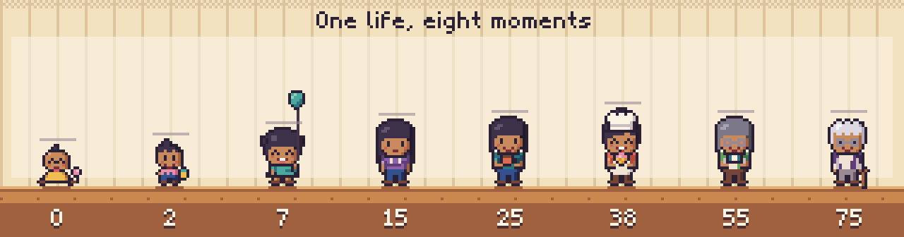
*One life, eight moments: Maya at 0, 2, 7, 15, 25, 38, 55 and 75, in front of a growth chart. Same person, different hair, clothes, props and posture at each age.*

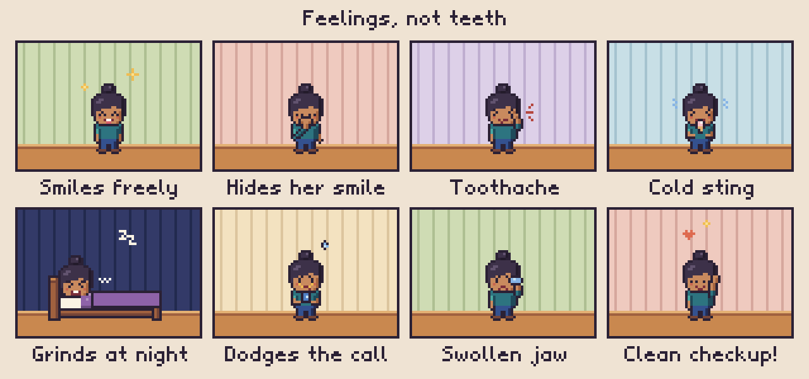
*How oral health shows up in a day: smiling freely, hiding a smile, a toothache, a cold sting, grinding at night, dodging the dentist's call, a swollen jaw, a clean checkup.*

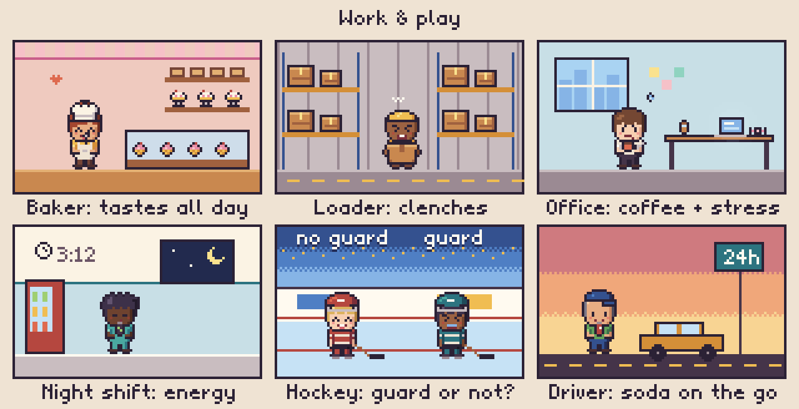
*Jobs and sports shape a mouth: the baker tasting all day, the loader clenching under a box, office coffee and stress, energy drinks on the night shift, hockey with and without a guard, soda on the road.*

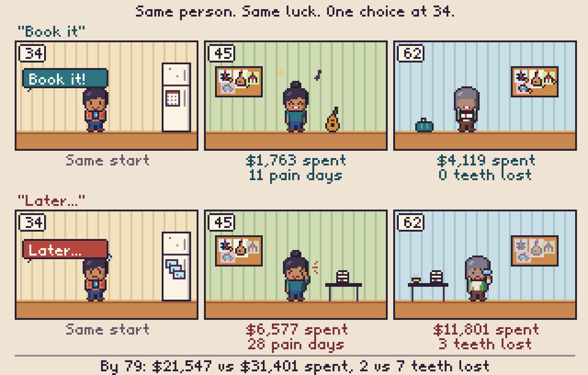
*Twin Lives: the same person with the same luck makes one choice at 34. At 45 the lives barely differ. At 62 the gap is obvious. Numbers are from the simulation (seed 26).*


*The Acid Clock: the same Tuesday as it is, with the same food eaten at meals, and at 70 on a drying medication. Below it, acid time per day across one life. See §4.5.*

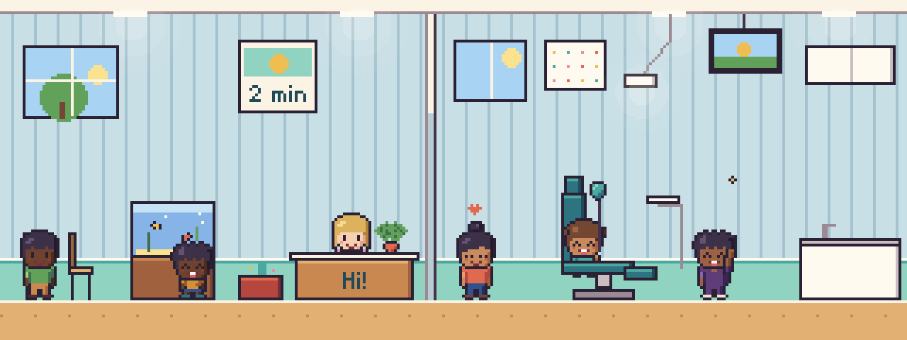
*The dentist as a warm place: fish tank, cartoons on the ceiling, a sticker chart, a smiling hygienist, June grinning in the chair with a balloon.*

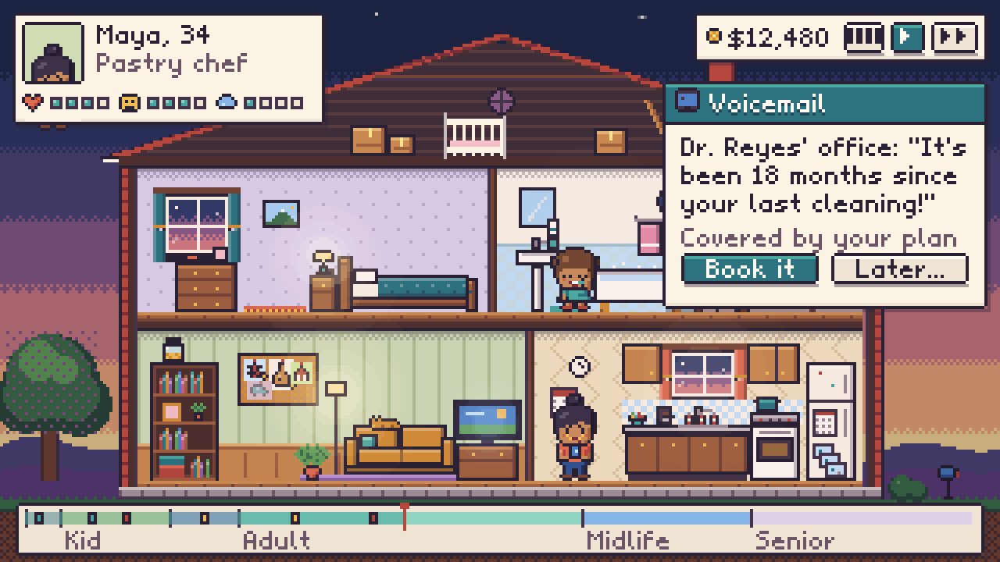
*The main screen: status panel (feelings, not stats), wallet and speed controls, an event card ("It's been 18 months!"), and the life timeline.*

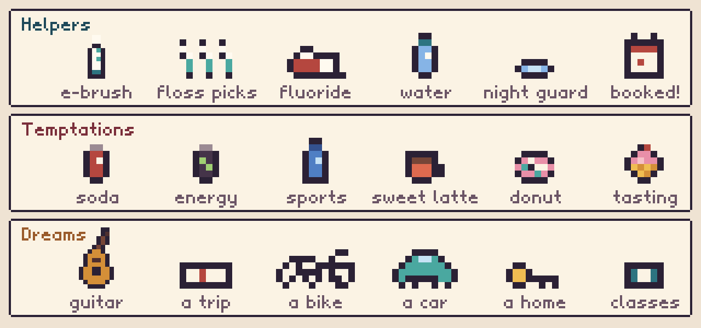
*The objects that carry the choices.*

---

## 9. Art direction

- **Native resolution 320×180**, integer-scaled: ×4 is 720p, ×6 is 1080p, ×8 is 1440p. CSS `image-rendering: pixelated`, with canvas smoothing off.
- **Palette "Hearth":** about 70 warm, slightly desaturated colors with purple-leaning shadows and ink (`#2b2135`) outlines instead of black. Five skin ramps and seven hair ramps. See `art/palette.js` and the swatch sheet below.
- **Characters are chibi paper dolls,** about 16×28 px for adults: `back hair → body (age × outfit) → arms (pose) → head (hairstyle) → face (expression) → glasses and hat → props`. Colors are **roles** (`skin.1`, `hair.0`, `top.2`...), so one sprite covers every skin tone, hair color and outfit. Current library: 5 age builds (baby, toddler, kid, teen, adult/senior) across 15 body-and-outfit sprites, 10 adult hairstyles plus 2 baby/toddler heads, 15 expressions, 12 arm poses, 4 hats, 47 props and ~35 furniture pieces.
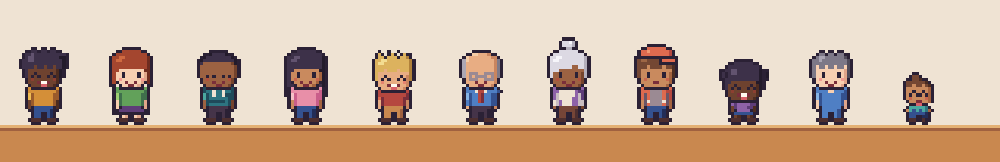
*One paper-doll system, many people: skin tone, hair, outfit, expression, pose, glasses and hats all swap.*

- **Age through the sprite, not a number:** baby, toddler, kid, teen, adult, then pepper hair and glasses, then white curls, cardigan and cane (see the lineup).
- **The house** is a two-storey side-view cutaway with an attic that collects memories (the crib, old hockey stick, boxes). Rooms map to life domains: bathroom (hygiene), kitchen (diet), bedroom (sleep, grinding), living room (money, dream board, social life), study (work). Decor evolves by era (a CRT TV in the '90s childhood, a flat screen later) and by life (a guitar, a bike, a cat).
- **Lighting:** day, dusk and night skies with warm lamp pools and a cool wash over rooms at night.
- **UI:** cozy RPG windows (cream panels, ink borders, teal accents) with a custom 6-px bitmap font for in-world text. The shipped game renders long text in the **DOM** with a pixel web font (Pixelify Sans or Silkscreen, both OFL) for accessibility and translation.
- **Animation list for M1 (2–4 frames each):** idle breathing and blink, walk (L/R), brush, eat, drink, sip, sleep, grind (night), wince, hand-to-cheek, cover mouth, laugh, phone ring, carry, sit at desk, work loops per job.
- **Audio (M3):** soft lo-fi chiptune with a warm Rhodes, room tones, and gentle stingers for good and bad visits. No drill sounds, ever.

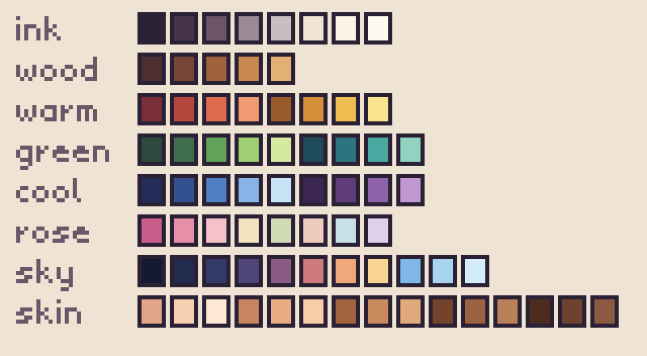

**Production note.** Everything here was drawn with code: hand-authored ASCII sprites rendered by `art/lib/pix.js`, a tiny framebuffer that works in Node (PNG export) and in the browser (the game), with pixel-identical output. It's good enough to ship a first version. A hired pixel artist could raise the ceiling (animation especially) by working in Aseprite and exporting to the same role-based format.

---

## 10. Tone, ethics and safety

- **Never scold.** Dentists and hygienists are warm. Returning after years triggers a "welcome back" moment, not a lecture. This follows Moore 2004: embarrassment tracks years of avoidance, and "the dentist told me I have bad teeth" was one of the most intense anxiety triggers.
- **Threat always comes with a way out.** Every consequence screen offers one concrete, one-time action (book, ask, buy, set a reminder), following Witte's EPPM and Tannenbaum 2015. Repeated behaviors (brushing) are handled through habit mechanics, not nagging.
- **No gore.** No decay close-ups, blood or drills.
- **No guilt for things people don't choose.** C-section is shown as a small, uncertain effect that habits outweigh. Parents' choices are framed as "what we knew then". Income and access barriers are visible and not moralized (after Spent).
- **Luck is real, and we say so.** A life can go badly despite good choices, and 100 Lives shows it. That keeps the lesson honest and defuses "my grandpa smoked and kept his teeth".
- **Evidence badges.** Every *Why?* card carries **Strong / Moderate / Emerging** labels, honest about the weak spots: flossing, xylitol, microbiome tests, C-section, and 6- vs. 12-month recalls.
- **Not medical advice.** Say so clearly and kindly. End screens point to "talk to a dentist" and local low-cost options (community clinics, dental schools).
- **Privacy:** no accounts; saves stay local (seed plus choice log). Analytics are opt-in and anonymous.
- **Inclusion:** five skin tones, hair textures, body types (M2), gender-neutral options, and names and outfits across cultures.

---

## 11. Tech plan

| Layer | Choice | Why |
|---|---|---|
| Simulation | Pure JS/TS module (`sim/`), deterministic, no dependencies | Same code for the game, the What-If Lab, 100 Lives, tests and calibration |
| Rendering | Canvas 2D at 320×180 via `art/lib/pix.js` (a framebuffer blitted to canvas), integer-scaled | Pixel-exact, tiny, no engine lock-in; same code exports PNGs |
| UI | DOM (buttons, cards, ledger) with a pixel web font, positioned over the canvas | Accessibility, screen readers, localization, text scaling |
| Content | Cards, jobs, sports and helpers as data (JSON/YAML) with an `effects` DSL mapping to plan changes | Designers and dental advisors can edit without code |
| Build | Vite + TypeScript; PWA (offline) | Fast; installable; works in waiting rooms with poor Wi-Fi |
| Saves | localStorage: `{ seed, choiceLog }`, replays reconstruct the life exactly | Tiny saves; Twin Lives for free |
| Testing | Unit tests on the model (monotonicity, e.g. more sugar never means fewer cavities on the same seed); calibration in CI with tolerance bands | Keep the model honest as content grows |
| Deploy | Static hosting (GitHub Pages or Netlify); an embeddable `<iframe>` for clinic sites; a kiosk mode that auto-resets | Cheap, portable |
| Localization | Fees, insurance and currency as a locale pack (US first; UK, CA and AU next) | Costs differ wildly by country |

**Performance:** one life takes ~11 ms in Node and 100 lives ~1 s. Fine for the 100-Lives screen in a Web Worker; the prototype isn't optimized yet (easy wins: no per-month object spreads, typed arrays for teeth).

---

## 12. MVP content scope

| Content | MVP (M1–M3) | Now (M0) |
|---|---|---|
| House | 1 house (family) + 1 apartment variant; 3 decor eras; day/dusk/night | 1 house, 3 skies ✓ |
| People | 8 ages × 2 builds; 5 skin tones; 10 hairstyles; 15 outfits | 5 age builds, 15 body/outfit sprites, 12 heads, 5 skin tones ✓ |
| Expressions and poses | 15 faces, 12 poses, 20 emote marks | 15 faces, 12 poses, 11 emotes ✓ |
| Props | ~60 | 47 props + ~35 furniture pieces ✓ |
| Event cards | ~60 across stages | 16 designed (§4.6) |
| Jobs / sports | 7 / 6 | in the model ✓, art for 6 ✓ |
| Helpers | 10 | in the design ✓ |
| Preset lives | 12 | 12 in the model ✓ |
| Screens | House, card, ledger, Life Story, 100 Lives, Twin Lives, What-If Lab, settings | Main screen mockup ✓ |

---

## 13. Roadmap

| Milestone | Scope | Estimate* |
|---|---|---|
| **M0: Plan & proof** ✓ | This plan; 12 art samples; toolkit; the Acid Clock; calibrated model prototype; report; review page with a working What-If Lab | done |
| **M1: Vertical slice** | Playable birth-to-80 life in the house at 1×/2×/4×; 20 cards; 6 helpers; year-end ledger; Life Story; local save | 3–4 weeks |
| **M2: The comparison engine** | What-If Lab; Twin Lives side by side; 100 Lives icon array; "Why?" view with evidence badges | 2–3 weeks |
| **M3: Content & feel** | 60 cards; all jobs and sports; animations; audio; apartment variant; era decor | 4 weeks |
| **M4: Clinical & access pass** | Dental advisor review of parameters and copy; verify the `[U]` parameters; calibration v1; accessibility audit; locale pack scaffolding | 2–3 weeks |
| **M5: Pilot** | Clinic waiting rooms and online; pre/post quiz; intention-to-book; A/B test of framing on the 34-year-old card; iterate | 4–6 weeks |

\*Rough, for one developer working with AI assistance plus part-time art and clinical help.

---

## 14. Decisions and open questions

**Decided (September 2026):**

1. **Audience: adults, young adults and parents at home.** "Live a Life" is the default mode, and cards are written for grown-ups and parents. There's no school or teen-classroom track in v1.
2. **Distribution: a free public game.** Clinics may use it as an educational tool: an embeddable, kiosk-friendly build with no clinic branding required.
3. **Fluoride: the balance, not the water debate.** Water fluoridation stays as a small, neutral "where you grew up" circumstance with its honest, modest modern effect. The emphasis moves to the daily ebb and flow of demineralization and remineralization: what tips it toward acid (frequency, timing, sleep, dry mouth, plaque) and what tips it toward repair (saliva, fluoride toothpaste, sealants, time between exposures). Too much fluoride has a cost too. Proposal: a parent choice between a smear and a pea-sized amount of toothpaste, with mild fluorosis as a possible (cosmetic, visible-in-the-mirror) outcome of swallowing too much in the early years.
4. **Clinical advisor: you.** You're a dentist. First review targets: the Acid Clock food table and critical pH values (§6.2), then the `[U]` parameters in `sim/params.js`, then the card copy.

**Being considered: recommendations with affiliate links.** The idea: a player who says a character is like them gets a short list of products and services matched to what drove *their* simulated outcomes (for example, the Acid Clock says sipping, or dry mouth). Only well-established or well-principled products qualify, and the links are affiliate. My proposed guardrails, so it reads as care and not a funnel:
- **The model never knows about products.** Recommendations are computed after the Life Story from the drivers of the outcome, and they never change a simulated result.
- **Evidence gate.** Every recommendation carries the same Strong / Moderate / Emerging badge as the *Why?* cards. Emerging items, microbiome testing for example, are framed as "see for yourself" tracking tools: re-test after a change and watch the pathogen load move. They're never presented as prevention on their own.
- **Pay can't buy placement.** The list is fixed by criteria first; the affiliate link, if any, is attached afterwards. Show a non-affiliate or generic option (e.g. "any fluoride toothpaste") whenever one exists, plus a plain disclosure (FTC endorsement rules).
- **Dentist-only items point to the dentist:** custom night guards, prescription 5,000 ppm fluoride, sealants.

**Still open:**

5. **Numbers during play.** My proposal: none while playing. The Life Story ledger, 100 Lives, the Acid Clock recap and an optional *Why?* view come afterwards. Agree?
6. **Costs:** US-only for v1?
7. **Art:** keep building with the code-drawn toolkit, or bring in a pixel artist for M3 animation polish?
8. **Name:** keep *Avoid the Dentist*? Alternates: *Small Now, Big Later*; *Open Wide, Live Long*; *Tooth & Consequences*.
9. **Next build (proposed):** draw the repair side of the Acid Clock (demineralization vs. remineralization), and add the toothpaste-amount choice with fluorosis.

---

## 15. Evidence table (condensed)

`[V]` = verified against a source abstract or summary during research (2026-09); `[U]` = recalled from the literature, verify before launch; `[D]` = design assumption or calibration knob.

| Parameter | Value in model | Source | Tag |
|---|---|---|---|
| Fluoride toothpaste | caries ×0.76 | Marinho 2003, Cochrane | V |
| Fluoride varnish | ×0.57 permanent / ×0.63 baby teeth | Marinho 2013, Cochrane | V |
| Water fluoridation, modern era | ×0.93 (low certainty) | Iheozor-Ejiofor 2024, Cochrane | V/D |
| Brushing <2×/day | ×1.30 (OR 1.45) | Kumar 2016 | V/D |
| Sealants | occlusal ×0.25 (OR 0.12 at 24 months) | Ahovuo-Saloranta 2017, Cochrane | V/D |
| Sugary drinks, daily | ×1.31 | Bernabé 2014 | V |
| Stephan curve | nadir within minutes of sugar; back in 30–60 min | Stephan 1944 | V |
| Critical pH | enamel ~5.5; root dentin/cementum ~6.2–6.7 | textbook consensus | V |
| Tooth-friendly test | plaque pH stays above 5.7 for 30 min | Imfeld (telemetry); Toothfriendly International | V |
| Saliva in sleep | flow virtually nil | Schneyer 1956; Dawes 2008 | V |
| Starchy snacks | slower drop, longer low pH, worse with low saliva | Lingström 1993 | V |
| Sugar-free gum after eating | faster plaque-pH recovery | Manning & Edgar 1993 | V |
| Cheese after sugar | raises plaque pH | Rugg-Gunn 1975 | U |
| Sugar at meals vs. between meals | far less decay at meals | Vipeholm (Gustafsson 1954) | U |
| Beverage acidity | sodas and sports drinks ~pH 3.1; juices ~3.5 | Reddy 2016 | V |
| Hyposalivation | unstimulated flow <0.1 vs. ~0.3–0.4 mL/min | clinical definition | V/D |
| Per-food dip depths, linger times, gum and water effects | see `sim/stephan.js` | design estimates | D |
| Bedtime bottle pooling on upper front teeth | ×3 on top of the all-night curve | nursing-caries pattern | D |
| Enamel → dentin progression | ~6%/yr; 65–86% never progress in 11 yrs | Mejàre 1999/2004 | V |
| Adolescent progression | ~3× adults | Mejàre 2004 | V |
| Baby-tooth decay that ever hurts | 18% | Levine 2002 | V |
| Baby-tooth decay → adult decay | RR 2.6 | Li & Wang 2002 | V |
| C-section and bacteria | acquired ~11.7 months earlier; caries OR 1.48 (low certainty); ×1.1 in model | Li 2005; Boustedt 2021 | V |
| Braces, white spot lesions | 46% of patients | Sundararaj 2015 | V |
| Gingivitis onset / resolution | ~14 days / ~7 days | Löe 1965 | V |
| Gum susceptibility classes | 8% rapid / 81% moderate / 11% none | Löe 1986 | V |
| Smoking, diabetes → periodontitis | RR 1.85 / 1.86 | Leite 2018; Nascimento 2018 | V |
| Gum treatment → HbA1c | −0.43 points | Simpson 2022, Cochrane | V |
| Tooth loss under maintenance | ~0.08 teeth/yr | Hirschfeld & Wasserman 1978 | V |
| Composite filling failure | ~2%/yr | Opdam 2014 | U |
| Root-canal tooth survival | ~87% at 8–10 yrs | Ng 2010 | U |
| Implant survival | ~96% at 10 yrs; peri-implantitis ~20% of patients | Howe 2019; Derks & Tomasi 2015 | U |
| Mouthguard | injury ×0.55 | Knapik 2007 | U |
| Dental trauma, lifetime | 15% permanent / 23% baby teeth | Petti 2018 | U |
| Dental fear, adults | ~15% | Silveira 2021 | U |
| CBT for dental fear | ~77% attending years later | Kvale 2004 | U |
| 6- vs. 24-month recall, low-risk adults | little difference | Clarkson 2020 (INTERVAL); Fee 2020 | U |
| Habit automaticity | median 66 days | Lally 2010 | U |
| Fear appeals | work only with efficacy; d≈0.29 | Witte 1992; Tannenbaum 2015; Kok 2018 | V |
| Gain vs. loss framing | gain frame best for dental hygiene | O'Keefe & Jensen 2007 | V |
| Dental shame and avoidance | embarrassment tracks years avoided | Moore 2004 | V |
| Future self-continuity | vivid aged self → more future-minded choices | Hershfield 2011 | V |

---

## Appendix: repo map

```
art/            pixel-art toolkit + sprites + scenes (browser & Node)
  lib/pix.js    framebuffer, sprites with role-based palettes, text, dithering, lighting
  lib/font.js   "Hearth" 6px bitmap font
  palette.js    the Hearth palette, skin/hair/cloth ramps
  sprites/      people (paper dolls), props, furniture, emotes
  scenes/       house cutaway, clinic, UI
  sheets.js     every art sample as a function
  acidclock.js  the Acid Clock strip, life chart and sheet
sim/            the hidden model
  model.js      one life, month by month
  stephan.js    the Acid Clock: a day's plaque-pH curve
  params.js     parameters with evidence tags
  rng.js        named random streams + hazard clocks ("same luck")
  lives.js      preset lives (and Maya)
  population.js random US-like lives for calibration and "Surprise me"
  run.mjs / levers.mjs / twolives.mjs / calibrate.mjs / report.mjs
docs/
  GAME_PLAN.md  this document
  SIM_REPORT.md generated numbers
  art/          exported PNGs (@1x and scaled)
tools/          render-art.mjs, preview.mjs
```

```bash
npm run art          # export all art samples to docs/art/
npm run sim          # preset lives table
node sim/report.mjs  # regenerate SIM_REPORT.md (calibration, presets, levers, Maya)
```
